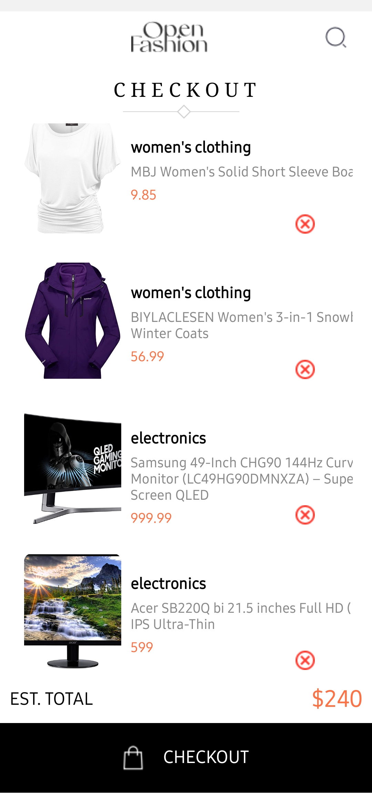

# rn-assignment7-11144852
# Bentil James Awusi

# React Native E-commerce App

This is a simple e-commerce app built using React Native. It fetches product data from an API, displays the product list, shows detailed product information, and allows users to add and remove items from their cart.


## Features
- Fetch product data from an external API
- Display a list of products
- View detailed information about a product
- Add products to the cart
- Remove products from the cart
- Persist cart items using AsyncStorage
- Navigation using React Navigation

## Installation
1. Clone the repository:
    ```bash
    git clone https://github.com/yourusername/your-repo-name.git
    cd your-repo-name
    ```

2. Install dependencies:
    ```bash
    npm install
    ```

3. Start the app:
    ```bash
    npx expo start
    ```

## Usage
1. Launch the app on your emulator or physical device.
2. Browse the list of products on the Home screen.
3. Tap on a product to view detailed information.
4. Add products to your cart by clicking the "Add to Cart" button.
5. View your cart by navigating to the Cart screen.
6. Remove products from your cart by clicking the "Remove from Cart" button.

## Dependencies
- React: ^18.2.0
- React Native: 0.72.4
- Expo: ~51.0.20
- React Navigation: ^6.x
- React-native-gesture-handler: ^2.17.1  
- React-native-reanimated: ^3.10.0
- React-native-safe-area-context: ^4.10.8
- React-native-screens: ^3.32.0
- AsyncStorage: @react-native-async-storage/async-storage@^1.17.11


## Code Overview
### Homepage
Fetches products from the API and displays them in a list. Each product has an "Add to Cart" button.

### Detailpage
Displays detailed information about a selected product. Allows adding the product to the cart.

### Checkoutpage
Displays the products added to the cart. Allows removing products from the cart.





